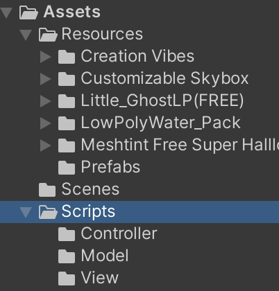
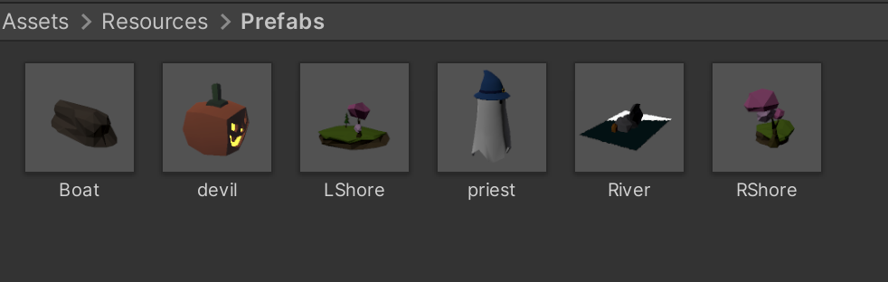
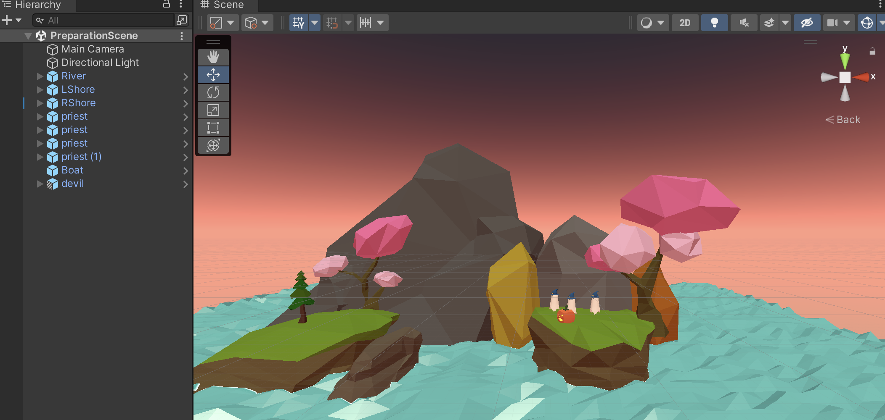
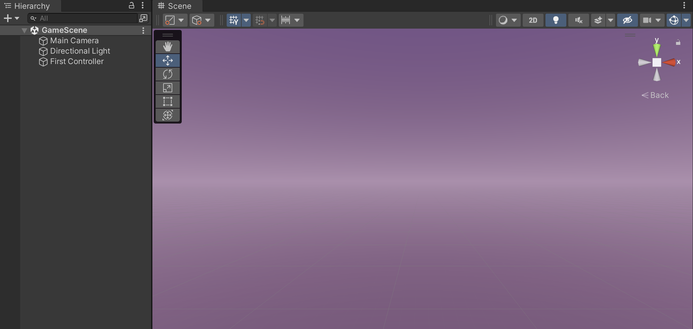
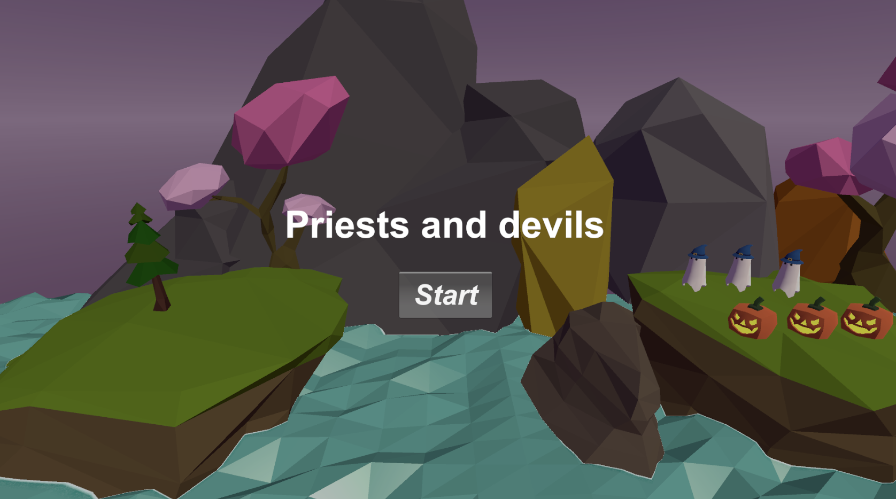
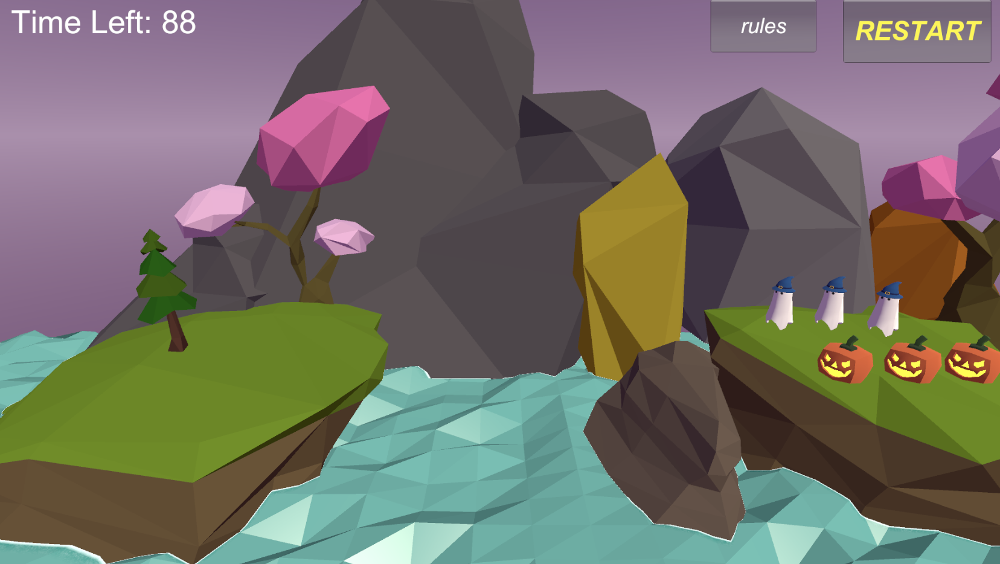
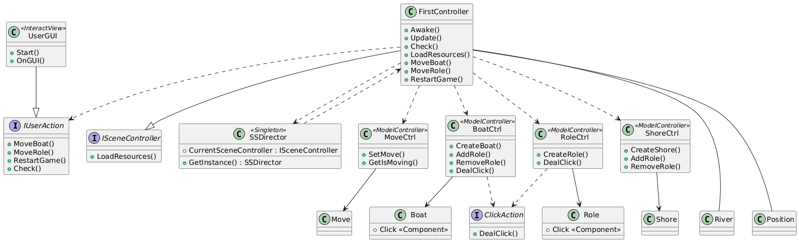

# 【3d-game-hw3】牧师与魔鬼unity小游戏

## 1 游戏简介

Priests and Devils is a puzzle game in which you will help the Priests and Devils to cross the river. There are 3 priests and 3 devils at one side of the river. They all want to get to the other side of this river, but there is only one boat and this boat can only carry two persons each time.

## 2 Assets架构与各文件说明

- Resources: 游戏中用到的free素材和由免费素材制作的游戏要用到的预制体，Scenes里面的PreparationScene是做prefabs是用的。

  

- Scenes: 有两个scene，GameScene是正式游戏场景，运行时才生成各实例；PreparationScene是做prefabs是用的。

  

  

- Scripts: 控制游戏逻辑的脚本，使用MVC结构：

  - **Controller：控制器层，负责协调游戏逻辑的各个部分**

    - FirstController：游戏主控制器，实现了 `ISceneController` 和 `IUserAction` 接口，负责初始化游戏场景、重启游戏、检查游戏状态并更新用户界面，**GameScene中通过创建一个空的游戏对象（命名为FristController），并将FristController脚本挂载于上来实现游戏启动、实例生成等等，是核心脚本。**
    - ISceneController：场景控制器接口，定义了 `LoadResources` 方法，确保所有场景控制器能够加载必要的游戏资源。
    - IUserAction：用户操作接口，定义玩家在游戏中可以执行的操作方法，如移动船和角色。
    - BoatCtrl：管理船的控制逻辑，包括船的状态、角色上船和下船以及船的位置。
    - MoveCtrl：控制角色和船只的移动逻辑，管理对象的移动动画和位置变化。
    - RoleCtrl：角色控制器，负责生成和管理每个角色的状态（牧师或恶魔），并处理角色的上下船行为。
    - ShoreCtrl：岸控制器，管理岸上的角色，控制左岸和右岸的牧师和恶魔分布。
    - SSDirector：游戏的单例控制器，负责管理场景控制器实例，确保全局唯一性和统一访问。

  - **Model：定义模型拥有的数据结构与记录状态**

    - Boat：船的模型类，表示船的具体属性，如容量、位置和状态（是否停靠在左岸或右岸）。
    - Role：角色的模型类，定义角色（牧师或恶魔）的属性和状态，包括是否在船上、所在岸边以及角色类型（牧师或恶魔）。
    - Click, ClickAction：点击检测类和接口，`Click` 类通过 `ClickAction` 接口实现点击事件处理，允许玩家点击角色或船只来触发相应的游戏逻辑。
    - Move：移动模型类，定义游戏对象的移动特性和逻辑，包括对象的位置变换。
    - Position：位置常量类，存储各个游戏对象（如船、角色、岸）的预设位置，确保对象在场景中正确排列。
    - River：河流模型类，用于生成游戏场景中的河流对象。
    - Shore：岸的模型类，定义左右岸的属性，并存储每个岸上牧师和恶魔的数量。

  - **View：用户交互逻辑实现**

    - UserGUI：用户界面类，负责渲染游戏的 UI 元素，包括剩余时间、提示信息和游戏规则等。`UserGUI` 显示游戏的开始界面、状态提示和重启按钮，并响应用户的界面操作。

      

      

## 3 游戏脚本UML图

## 4 游戏演示视频

https://www.bilibili.com/video/BV1auSQYaEks/